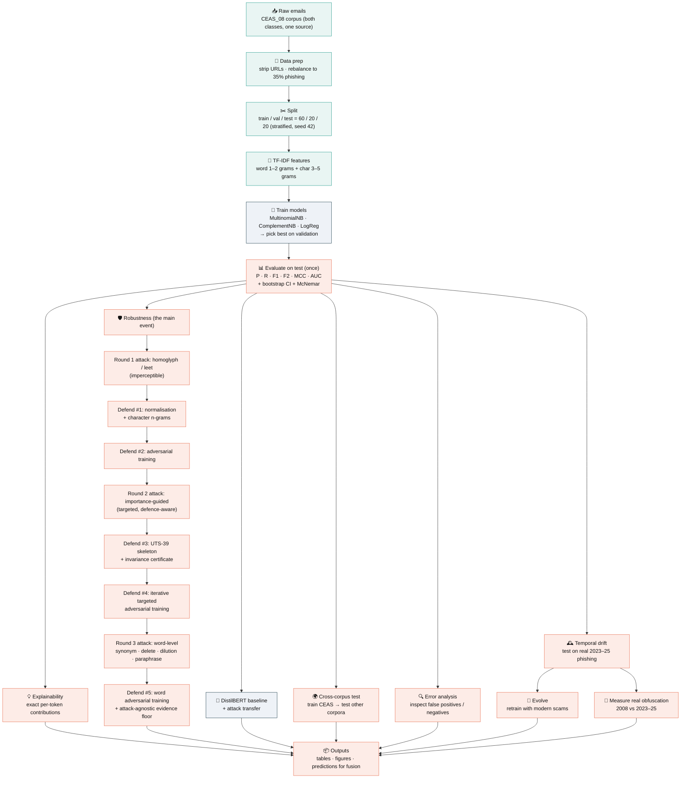

# PhishFusion — Student A (Content / NLP Detector): Project Plan (v2, extended to v10)

*Planning document. **The v2 body below was written before any code ran** (so it originally used
`[PLACEHOLDER]` numbers and design intent). The project is now fully implemented — the **real results
live in the changelogs (v3–v10 below), the result tables (`results/tables/`), and the report**. Trust
those, not any leftover placeholder phrasing in the v2 text. Current entry point: `/PROJECT_HANDOFF.md`.*

**v2 changelog (what a strict review forced):** promoted the corpus-confound problem to a
first-class methodological threat with a mitigation protocol; replaced "defend against my own
attack" with a held-out / adaptive-attacker evaluation; added statistical validity (bootstrap CIs +
McNemar); fixed the DistilBERT comparison to be fair; corrected "concept drift" → "domain shift"
and added a genuine temporal-drift experiment; added cost-sensitive thresholding, error analysis,
LIME/SHAP, an imbalance sweep, reproducibility engineering, an ethics note, and an honest
contribution statement.

**v3 changelog (2026-07-06/08 — improvement pass, all implemented + re-run end-to-end):** added
five *additive* experiments that deepen the robustness/critical-evaluation story without touching
the (saturated, deterministic) core pipeline. See §3 rows **E10–E14** and §9 tables **T10–T16** /
figures **F12–F16**. (A) an **importance-guided (adaptive) attacker** — greedy word-importance
evasion in the DeepWordBug/TextBugger/HotFlip family — that sets a substantially lower defence
ceiling than the uniform attacker (union 0.99→**0.88**, word →**0.67**); (B) a **diagnosis of the
cross-corpus collapse** (prior/threshold shift — OOD AUC 0.78, re-threshold F1→0.75 — plus a real
vocabulary gap, OOV 0.07→0.20); (C) **multi-seed robustness CIs** (K=10, sd ≤ 0.004); (D) the
**false-positive cost of the normalisation defence** on clean mail; (F) **probability calibration**
for the fusion step. This resolves the old "cite or drop `morris2020textattack`" TODO (now cited for
the importance-guided attack).

**v4 changelog (2026-07-08/09 — advanced pass, implemented + re-run):** two tracks. **Track 1 (arms
race)** closes the gap the v3 targeted attacker opened: E15 a principled **UTS-39 skeleton
canonicaliser** (`normalize_skeleton`, from Unicode `confusables.txt`) restores recall to
0.993/0.998 where the hand-table failed (Pruthi-2019 rule-vs-principled contrast); E16 a **robustness
certificate** (100% certifiably-invariant vs the glyph family, deterministic); E17 **iterative
targeted adversarial training** (0.44→0.999, beats one-shot uniform); E18 the skeleton defence's
**cost** (free — same FPR). **Track 2 (external validity)** adds 1,303 real **2023–2025 Nazario
phishing** emails: E19 **temporal drift** (a 2008 model catches only 14%); E20 **real-obfuscation
measurement** (homoglyph/zero-width ≈0% in 2008 → 1.8%/4.0% modern — the threat model is real).
Tables **T17–T22**, figures **F17–F19**. Deferred: modern-ham retrain (public modern ham scarce).

**v5 changelog (2026-07-09 — "hack it again + evolve it", implemented + re-run):** presentation
arc = build → hack → fix → **evolve**. **Next attack class (E21–E22):** the certified character
defence pushes the attacker to *words*, so E21 tests word-level attacks — synonym (weak, 0.998),
delete (moderate), and **dilution** (pad with legit words → union recall 0.998→**0.129**); the
character defence can't touch it; E22 fixes it with adversarial training on word attacks
(dilution 0.284→**1.000**). **Evolve (E23–E24):** E23 retrains with modern scams (ham source
unchanged) → recall on modern scams **0.147→0.980**, no forgetting, FPR 0.007; E24 a full modern
detector (modern scams + Apache-list ham) scores F1 0.996 but the source-separability probe is
**0.992** → provenance confound disclosed. Tables **T23–T26**, figures **F20–F21**; new data
`data/raw/modern_ham/`, script `scripts/parse_modern_ham.py`; plain-language story
`docs/IMPROVEMENTS_STORY.md`.

---

## 0. Research questions (the plan now answers questions, not "trains a model")

- **RQ1 (signal):** How well does a purely lexical model (TF-IDF + NB/LogReg) separate phishing from
  legitimate email, *after controlling for corpus artifacts*?
- **RQ2 (robustness):** How much does character-level obfuscation (homoglyph / leet / separator)
  degrade a lexical detector, and how much do normalization and char n-grams recover — *against
  attacks the defense was not designed for*?
- **RQ3 (transfer):** Do attacks crafted against the lexical model transfer to DistilBERT, and does
  the same normalization defense help a transformer?
- **RQ4 (trade-off):** What is the measurable cost, in interpretability, of the features that buy
  robustness?
- **RQ5 (guarantees):** Can a defence be made *provable* rather than merely empirical, and what does
  the guarantee cost in detection accuracy? (Added v7; answered by the UTS-39 certificate and the
  monotone model — one nearly free, one costing ~9 F1 points.)
- **RQ6 (deployment):** What is a single user report worth against a real phishing campaign, and what
  new attack surface does that feedback channel create? (Added v8; answered in §5 of the report.)

Every experiment below maps to one RQ. Anything that maps to no RQ is cut.

---

## 1. The corpus-confound threat and how the data solves it

**The danger:** if legit and phishing come from *different* corpora, a model can score near-perfect by
learning *provenance* (headers, era, mailing-list footers, MIME quirks) rather than *phishing-ness*.
`Nazario` and `Nigerian_Fraud` are **single-class** (100% phishing), so using them as *the* phishing
source against a separate ham corpus would make `label` ≈ `source` — worst-case confound.

**The fix the data hands us (decided after inspecting the CSVs, 2026-07-02):**
`CEAS_08` contains **both classes inside one corpus** (21,842 phishing / 17,312 legit; same era, same
header style). So the **primary phishing-vs-legit experiment (E1–E8) runs entirely within CEAS_08** —
the corpus artifact is removed *by construction*, not by hoping a probe comes back clean. `SpamAssasin`
(1,718 / 4,091) is a second, smaller within-corpus testbed for a robustness check.

**Mitigation protocol:**
1. **Primary testbed = a single mixed-class corpus (CEAS_08).** No cross-corpus label leakage possible.
2. **Corpus-ID probe (E0).** Still run it: train a classifier to predict `source` across all corpora.
   A high score quantifies *how* separable the corpora are and justifies why we do **not** pool them
   for the main experiment. Report the number openly.
3. **Header/boilerplate stripping.** Remove `Received:`/date lines, footers, signatures, and the
   `urls`/`sender`/`receiver` fields from the *text* (see §2 on URL leakage).
4. **Cross-corpus as the honest generalization test (E9a), not the main number.** Train on CEAS_08,
   test on Nazario+Nigerian (OOD phishing) and Enron/Ling (OOD ham). This measures real transfer;
   the abstract quotes it alongside the in-corpus CEAS_08 result.

This is a stronger design than v2's "pool everything and probe" — the mixed-class corpus makes the
main result trustworthy on its own.

---

## 2. Dataset

**SOURCE (acquired 2026-07-02):** the Kaggle "Phishing Email Dataset" (Naser Abdullah Alam)
compilation, extracted to `data/raw/kaggle_phishing/`. We use the **per-source CSVs** (not the merged
`phishing_email.csv`) so `source` is preserved. Actual contents as inspected:

| CSV | Rows | Phishing (1) | Legit (0) | Date? | Role in this project |
|---|---|---|---|---|---|
| **CEAS_08** | 39,154 | 21,842 | 17,312 | ✅ 2008 | **Primary within-corpus testbed (E1–E8)** |
| SpamAssasin | 5,809 | 1,718 | 4,091 | ✅ 2002 | Second within-corpus robustness check |
| Nazario | 1,565 | 1,565 | 0 | ✅ (→2017) | OOD phishing for cross-corpus test (E9a) |
| Nigerian_Fraud | 3,332 | 3,332 | 0 | ✅ 2002+ | OOD phishing for cross-corpus test (E9a) |
| Enron | 29,767 | 13,976 | 15,791 | ❌ | OOD ham for cross-corpus test |
| Ling | 2,859 | 458 | 2,401 | ❌ | OOD ham for cross-corpus test |
| phishing_email | 82,486 | 42,891 | 39,595 | ❌ | **ignored** (merged; no `source`/`date`) |

Schemas differ: CEAS/Nazario/Nigerian/SpamAssasin have `sender, receiver, date, subject, body, urls,
label`; Enron/Ling have only `subject, body, label`. `src/data.py` harmonizes to
`{source, date?, subject, body, label}`.

- **Balance:** overall ≈52% phishing — **not** naturally imbalanced. The ComplementNB advantage
  (Rennie 2003) therefore **must** be tested via the induced-imbalance sweep (E3b); it cannot be
  claimed from this data as-is.
- **URL leakage decision (do this deliberately):** `urls`/`sender`/`receiver` are your partner's
  (Student B) signal. For a *content-only* detector, strip URLs out of `body` (replace with a `URL`
  token or drop) so the text model isn't secretly using link features. Report that you did this.
- **Dates → temporal work is limited.** Only CEAS (single year, 2008) is mixed-class with dates;
  Nazario's wide span is single-class. A clean temporal concept-drift experiment is therefore
  **weakly supported** — E9b is demoted to *optional / exploratory* (see §3). Domain shift (E9a) is
  the primary generalization story.
- **Reproducibility:** after harmonizing, write `emails_working.csv` and record its SHA-256 + row count
  in `results/tables/data_hash.txt`. Keep the raw CSVs in the repo (or note the exact Kaggle version).
- **Anonymization:** drop `receiver`; do not store full raw emails in the report; corpora are public.

---

## 3. Experiment plan

| # | Experiment | RQ | Statistical treatment | Output |
|---|---|---|---|---|
| E0 | **Corpus-ID probe + header stripping** | RQ1 | probe accuracy + CI | quantifies corpus separability; justifies single-corpus testbed |
| E1 | EDA (**on CEAS_08**) | RQ1 | — | balance, lengths, dups, missing, non-ASCII rate, discriminative tokens |
| E1b | **Trivial baselines** | RQ1 | bootstrap CI | majority-class, keyword-list — anchors accuracy paradox |
| E2 | Feature ablation (clean) | RQ1 | CI + McNemar vs best | word / char / union metrics |
| E3 | Model comparison (clean) | RQ1 | CI + McNemar | MNB / CNB / LogReg |
| E3b | **Induced-imbalance sweep** | RQ1 | CI across ratios | tests the CNB claim (Rennie 2003) honestly |
| E4 | Hyperparameter tuning (**val only**) | RQ1 | val-vs-test gap | best config; overfitting check |
| E5 | Explainability + **robustness/interpretability trade-off** | RQ4 | explanation stability | LIME/SHAP + coeff; char-feature opacity |
| E6 | **Evasion attack** ⭐ | RQ2 | recall CI at each budget | word-only collapse vs union |
| E7 | **Defenses, incl. held-out + adaptive attacker** ⭐ | RQ2 | CI per defense | honest recovery + defense ceiling |
| E8 | **DistilBERT (fair setup), clean + attacked** | RQ3 | CI + McNemar vs TF-IDF | fair comparison + transfer |
| E9a | Cross-corpus **domain shift** ⭐ | RQ1 | CI | train CEAS_08 → test Nazario+Nigerian (OOD phishing) / Enron+Ling (OOD ham) |
| E9b | Temporal **concept drift** (*optional/exploratory*) | RQ1 | CI over time bins | data-limited (CEAS = 2008 only); attempt within CEAS months or Nazario-by-year with caveats |
| **E10** | **Importance-guided (adaptive) attack** ⭐ (v3) | RQ2 | targeted vs uniform recall at matched budget | greedy word-importance evasion (DeepWordBug/TextBugger/HotFlip); true defence ceiling (T10/T11/T12, F12) |
| **E11** | **Cross-corpus collapse diagnosis** (v3) | RQ1 | threshold sweep + OOV + score dist | prior-shift vs vocabulary-gap decomposition (T13/T13b, F14) |
| **E12** | **Multi-seed robustness CIs** (v3) | RQ2 | K=10 seeds, mean±sd | stability of every T5 cell (T14, F15) |
| **E13** | **Cost of the defence** (v3) | RQ2/RQ4 | precision/FPR on clean mail | false-positive cost of normalising legit mail (T15) |
| **E14** | **Calibration for fusion** (v3) | — | Brier/ECE + reliability + isotonic | are the probabilities fit to be fused (T16, F16) |
| **E15** | **UTS-39 skeleton canonicaliser** ⭐ (v4) | RQ2 | recall vs targeted-adaptive | principled defence closes the v3 gap (T17); Pruthi rule-vs-principled |
| **E16** | **Robustness certificate** (v4) | RQ2 | % certifiably invariant | deterministic guarantee vs the glyph family (T18) |
| **E17** | **Iterative targeted adversarial training** (v4) | RQ2 | recall per round | 0.44→0.999; beats one-shot uniform (T19, F17) |
| **E18** | **Skeleton defence cost** (v4) | RQ2/RQ4 | precision/FPR clean mail | closes the gap for free (T20) |
| **E19** | **Temporal drift on modern phishing** ⭐ (v4) | RQ1 | recall by year 2023-25 | 2008 model catches 14% of modern phishing (T21, F18) |
| **E20** | **Real-obfuscation measurement** ⭐ (v4) | RQ2 | obfuscation rates modern vs 2008 | homoglyph/zero-width real & growing (T22, F19) |
| **E21** | **Word-level attacks (next class)** ⭐ (v5) | RQ2 | recall by budget | synonym/delete/dilution; dilution 0.998→0.13 (T23, F20) |
| **E22** | **Word-attack defence** (v5) | RQ2 | recall before/after | adv-training on word attacks; dilution 0.28→1.0 (T24) |
| **E23** | **Evolve on modern scams (clean)** ⭐ (v5) | RQ1 | recall on modern scams | 0.147→0.980, no forgetting, FPR 0.007 (T25, F21) |
| **E24** | **Modern mixed detector (confound)** (v5) | RQ1 | F1 + source-separability | F1 0.996 but 0.992 separable → disclosed (T26) |

**Primary testbed for E1–E8 is CEAS_08** (mixed-class, confound-free). E9a is the honest
generalization number; E10–E14 (v3) are additive extensions run on the same CEAS_08 model. Test set
touched **once**; all tuning/selection on val.

---

## 4. Methodology (write-up ready)

**4.1 Split.** Stratified 60/20/20 by `label`, seed 42, on **CEAS_08** for the in-corpus experiments
(E1–E8). For E9a the split is **by corpus** (train CEAS_08 → test the OOD corpora). For the optional
E9b it is **by time** within a corpus (train ≤ *t*, test > *t*), with the caveat that CEAS is a single
year so the temporal signal is thin. State each split explicitly.

**4.2 Preprocessing.** Subject+body concat; control-char strip; lowercasing. Header/boilerplate
stripping per §1.2. Normalization is applied **only as a defense arm** (kept separable for ablation).

**4.3 Features.** TF-IDF, `sublinear_tf`. Three configs: word 1–2 grams (stop-words, tuned `min_df`);
char_wb 3–5 grams; union. Explain TF, IDF (up-weights rare cues like "verify account"), word vs char
n-grams, sub-word robustness.

**4.4 Models.** MultinomialNB, ComplementNB, LogisticRegression. State Bayes' theorem +
conditional-independence assumption; Laplace/add-one smoothing → zero-frequency problem; CNB for
imbalance (**tested in E3b, not assumed**); LogReg as interpretable linear baseline.

**4.5 Statistical validity (new, non-negotiable).**
- **Bootstrap 95% CIs** on every headline metric (1000 resamples of the test set). Report `F1 = x
  [lo, hi]`.
- **McNemar's test** for every paired classifier comparison on the same test set; report *p* and
  call differences "not significant" when they are.
- Never claim a win from a point estimate alone.

**4.6 Threat model + attack (RQ2).** Attacker edits email text, not the pipeline (test-time evasion).
Settings: **black-box** (uniform perturbation) and **grey-box** (targets high-weight tokens).
Perturbations: homoglyph (Latin→Cyrillic/Greek confusables), leet, separator injection — bounded by a
**perceptibility constraint** (max fraction of characters changed) so attacks stay human-readable, as
in TextBugger/VIPER. Report the perturbation budget as an axis (E6 sweep).

**4.7 Defenses + honest evaluation (RQ2).**
- Defenses: Unicode/homoglyph→ASCII normalization (**built from the Unicode TR39 confusables set,
  not from my own attack map**), de-leet, separator strip, char n-grams, optional adversarial
  training.
- **Anti-tautology protocol:** partition perturbation types into *seen* (used to build/tune the
  defense) and *held-out* (never seen by the defense — e.g., zero-width chars, Greek confusables,
  unmapped substitutions). Report recovery on **held-out** attacks — that is the real number.
- **Adaptive attacker:** an attacker who knows normalization is applied and uses only
  confusables/zero-width chars the normalizer misses. This measures the **defense ceiling** and
  prevents a false "solved it" claim.

**4.8 Evaluation + cost sensitivity (new).** Confusion matrix, precision, recall, F1, MCC, AUC-ROC,
**PR curves**. Define a **cost matrix** (FN ≫ FP for phishing) and pick the **cost-optimal
threshold** on val; report metrics at that operating point *and* at 0.5. This is what makes the
"FN endangers the org / FP tires the SOC" argument quantitative rather than rhetorical. State the
accuracy paradox in the attacked/imbalanced regime.

**4.9 DistilBERT — fair comparison (RQ3).** Fixes vs the draft: `max_length` ≥ 256 (do not truncate
the body to 64 tokens); shuffled batches; **validation-based early stopping**; LR warmup; fixed seed.
Report both a **matched-compute caveat** and the honest limitation that this is a lightweight
fine-tune, so a tie with TF-IDF is *suggestive*, not proof of BERT's ceiling. Attack DistilBERT too,
and test attack **transferability** (attack crafted on TF-IDF → evaluated on BERT).

**4.10 Error analysis (new).** Manually inspect ≥5 false positives and ≥5 false negatives (clean and
attacked). Categorize failure modes. This drives the Discussion.

**4.11 Ethics / dual-use (new).** The attack generator is for defensive evaluation only; note
responsible-use, keep it in-repo for reproducibility, do not frame as an operational evasion tool.

---

## 5. Academic papers — framed as *conceptual replication*, not reproduction

**DECIDED (2026-07-02): go deep on ONE anchor (Eger, robustness — the "wow" part), light on two.**
Three shallow "paper said X" comparisons read as box-ticking; one deep replication + two brief ones
reads as focus.

- **Eger et al. 2019 (VIPER, NAACL) — DEEP anchor (the centerpiece comparison).** Visual/homoglyph
  attacks degrade NLP; shielding recovers. → Blueprint for E6/E7. Do the *full* treatment: quantify
  the attack curve, evaluate the defense on **held-out + adaptive** attacks (a *stronger* test than
  VIPER's own defense), and write the extended "VIPER claimed X on model M; on phishing email with a
  rule-based TR39 normalizer I saw Y, and the adaptive attacker exposes ceiling Z" analysis. Pair with
  **Pruthi 2019** (learned vs rule-based normalization contrast) since it feeds the same story.
- **Rennie et al. 2003 (ComplementNB, ICML) — LIGHT anchor.** Claim: CNB corrects NB bias under
  imbalance. → **E3b** tests it in one paragraph: CNB≈MNB at balance, does CNB pull ahead as we skew?
  Report the result briefly; don't over-build.
- **Metsis et al. 2006 ("Which Naive Bayes?", CEAS) — LIGHT anchor.** → One table (E3) contrasting
  your NB-variant ranking with theirs, one sentence of mechanism. Kept short.
- **Pruthi et al. 2019 (misspelling defense, ACL).** Normalize-before-classify. → Contrast their
  *learned* recognizer with your *rule-based* TR39 normalizer; predict and then test where rule-based
  fails (the adaptive attacker, §4.7).

Supporting (lit-review depth): Sahami 1998; Fette 2007 (PILFER); Abu-Nimeh 2007; Bergholz 2010;
Cavnar & Trenkle 1994; Zhang/Zhao/LeCun 2015; Szegedy 2014 / Goodfellow 2015; Gao 2018 (DeepWordBug);
Li 2019 (TextBugger); Ebrahimi 2018 (HotFlip); Boucher 2022 (Bad Characters); Morris 2020
(TextAttack); Vaswani 2017; Devlin 2019; Sanh 2019; Chicco & Jurman 2020 (MCC); Salloum 2022 (survey).
Unicode **TR39 confusables** as the standards reference for the normalizer.

**Minimum viable set:** Rennie 2003, Metsis 2006, Eger 2019, Pruthi 2019, Devlin 2019, Chicco 2020,
Salloum 2022, Boucher 2022.

---

## 6. Literature-review skeleton (report §2)

Classical NB/keyword (Sahami, Metsis) → feature-engineered phishing (PILFER, Bergholz, Abu-Nimeh) →
transformer detectors (BERT/DistilBERT) → adversarial NLP attacks (DeepWordBug, TextBugger, HotFlip,
Bad Characters) and defenses (VIPER shielding, Pruthi). **Gap:** most phishing-NLP work reports clean
accuracy; robustness to cheap character obfuscation, evaluated against *held-out and adaptive*
attacks, is under-reported — and the interpretability cost of the robust features is rarely
quantified. **Your position:** an honest empirical study of that gap on phishing email, with
corpus-confound controls and statistical validity.

---

## 7. Final report outline (Overleaf-style)

Abstract (quote the **cross-corpus** number + one caveat) → 1 Introduction (threat, why NLP, why
robustness+explainability in a SOC, contributions) → 2 Background & Lit Review (§6) → 3 Methodology
(§4, incl. threat model, statistics, cost model, confound controls) → 4 Experiments & Results (E0–E14,
each with CIs and its "vs paper" note; v3 adds the importance-guided attacker, robustness-stability,
defence-cost, cross-corpus diagnosis, and calibration subsections) → 5 Discussion (error analysis, why classical ties BERT with
caveats, domain shift vs drift, confound findings, robustness↔interpretability trade-off, limitations)
→ 6 Conclusion (honest contribution + future work: fusion with URL detector, learned normalizer,
adversarial training at scale) → References (.bib) → Appendix (grids, extra matrices, repro commands,
data hash).

---

## 8. Implementation checklist (code)

**Confound + data:** `src/data.py` (download+merge+`source`+`date`, header stripping, SHA-256
snapshot); corpus-ID probe.
**EDA + baselines:** class balance, missing/dups, non-ASCII rate, discriminative tokens; majority +
keyword baselines.
**Features/models:** `features.py` (word/char/union); `models.py` (MNB/CNB/LogReg, `tune_on_val`);
`config.py` (seeds/paths/grids). Induced-imbalance sweep.
**Stats:** `stats.py` — `bootstrap_ci()`, `mcnemar()`.
**Explain:** `explain.py` — signed coeffs + **LIME/SHAP** on sample emails + char-feature opacity note.
**Attack/defense:** `attacks.py` (homoglyph/leet/separator/zero-width, budget, grey-box, adaptive);
`normalize.py` (TR39-based); seen/held-out partition; adversarial-training option.
**Eval:** `evaluate.py` — metrics+CIs, confusion, ROC+PR, **cost-optimal threshold**; writes
`results/tables/*.csv`.
**BERT:** `bert.py` — fair fine-tune (max_length≥256, shuffle, early stop), clean+attacked+transfer.
**Repro:** `run_all.py` regenerates everything; pinned `requirements.txt`; versions logged.
**Ethics:** short `ETHICS.md` note on dual-use.

---

## 9. Figures & tables (all IMPLEMENTED — see `results/tables/` T0–T40 and `results/figures/` F1–F24)

**Tables:** T0 corpus-ID probe (pre/post header strip) · T1 dataset composition · T2 clean feature
ablation (+CI, McNemar) · T3 model comparison (+CI) · T3b imbalance sweep (CNB vs MNB) · T4 best
hyperparams + val/test gap · T5 **robustness: recall/F1/MCC × {clean, attacked, +norm, +char,
+advtrain, held-out attack, adaptive attacker} × {word-only, union, DistilBERT}** (centerpiece) · T6
cross-corpus (E9a) · T7 DistilBERT vs TF-IDF clean+attacked+transfer · cost-optimal vs 0.5 threshold.

**Figures:** F1 balance+length · F2 discriminative tokens · F3 confusion (best clean) · F4 signed
weights (+LIME example) · **F5 recall clean/attacked/defended, word-only vs union (money figure)** ·
F6 ROC+PR overlay · F7 recall vs perturbation budget (attack sweep) · F8 transferability (TF-IDF
attack → BERT) · F9 temporal drift curve (E9b) · F10 corpus-ID probe bar (confound evidence) ·
F11 Spearman correlation heatmap.

**v3 additions (implemented):**
- **Tables:** T10 targeted-vs-uniform attack budget · T11 targeted-adaptive defence ceiling ·
  T12 attack effort (words/letters to flip) · T13 cross-corpus diagnosis + T13b OOD threshold sweep ·
  T14 multi-seed robustness CIs · T15 defence cost (FPR on clean mail) · T16 calibration (Brier/ECE).
- **Figures:** F12 targeted vs uniform recall curve · F14 OOD diagnosis (threshold sweep + score
  histograms) · F15 multi-seed robustness bars (±sd) · F16 reliability curve.
  (Naming note: the imbalance-sweep figure ships as `F_imbalance_sweep.png`; F13 was long left unused —
  the targeted-adaptive ceiling is a table, T11 — but as of v10 **F13 = `F13_eda_boxplots.png`**, the EDA
  box plots.)

**v4 additions (implemented):**
- **Tables:** T17 skeleton-canonicaliser ceiling · T18 robustness certificate · T19 iterative
  adversarial training · T20 skeleton defence cost · T21 temporal drift (modern phishing) ·
  T22 real-obfuscation measurement.
- **Figures:** F17 iterative adv-training rounds · F18 temporal drift by year · F19 real-obfuscation
  bars (modern vs 2008).
- **New data/scripts:** `data/unicode/confusables.txt` (UTS-39); `data/raw/nazario_recent/` (modern
  2023-25 phishing); `scripts/parse_nazario_recent.py`.

**v5 additions (implemented):**
- **Tables:** T23 word-level attacks · T24 word-attack defence · T25 evolve-on-modern (clean) ·
  T26 modern mixed detector (+ source-separability confound).
- **Figures:** F20 word-level attack curves · F21 evolve (2008 vs evolved recall on modern scams).
- **New data/scripts:** `data/raw/modern_ham/` (modern Apache-list ham); `scripts/parse_modern_ham.py`;
  plain-language narrative `docs/IMPROVEMENTS_STORY.md`.

---

## 10. Buzzword → where earned

EDA→E1 · BoW/TF-IDF/tokenization/stop-words/word+char n-grams→§4.3 · NB/Bayes/conditional
independence/Laplace/zero-frequency/ComplementNB/**class imbalance**→§4.4,E3b · LogReg/interpretability
→E3,E5 · train/val/test/overfitting/generalization→E4 · confusion/P/R/F1/**MCC**/accuracy-paradox/
AUC/**PR**/FP-FN/**cost**→§4.8,E1b · explainability/feature-importance/**LIME/SHAP**→E5 · adversarial
ML/evasion/perturbation/homoglyph/leet/**edit-distance**/white-black-box/**transferability**/robustness/
adversarial-training/normalization-defense→E6,E7,E8,F8 · **word-importance/greedy attack (DeepWordBug/
TextBugger/HotFlip)/grey-box/defence-ceiling**→E10 · **prior-shift/domain-gap/OOV/threshold-transfer**→E11 ·
**bootstrap-stability/multi-seed CIs**→E12 · **false-positive cost/FPR**→E13 · **calibration/Brier/ECE/
reliability/isotonic**→E14 · **Unicode UTS-39/confusables-skeleton/canonicalisation**→E15 ·
**certified-robustness/provable-invariance**→E16 · **iterative adversarial training**→E17 ·
**concept-drift/temporal-generalisation**→E19 · **real-world threat validation**→E20 ·
embeddings/transformers/self-attention/BERT/
DistilBERT/fine-tuning/transfer-learning→E8 · **domain shift**→E9a · **concept drift**→E9b (temporal, optional/data-limited) ·
phishing/spam/social-engineering→Intro · anonymization→§2 · dual-use/ethics→§4.11.

---

## 11. Planned next tasks — **P1, P2, P3, P5, P6, P7, P8, P9 now IMPLEMENTED** (P9: 2026-07-20)

**v10 changelog (2026-07-21 — "course grounding + deeper EDA", implemented + re-run):** Reviewed the
semester's lecture decks (EDA, statistics, goodness-of-fit, adversarial attacks, explainability, NLP-in-
cyber) and connected the project to them where it justifies a real decision (not decoration).
**Deeper EDA (§2c):** added distribution shape (skewness/kurtosis) of the interpretable features
(ratio features strongly right-skewed & leptokurtic → justifies Spearman + median over Pearson/mean);
**VIF** redundancy (len_chars/n_words VIF ~21 >10 → keep diagnostics-only); a **Mann-Whitney U** test of
"phishing is shorter" (p<<0.001); and a **box-plot figure (F13**, previously the one unused slot).
New tables **T9b_eda_shape, T9c_eda_vif**, figure **F13_eda_boxplots**. **Report grounding added:**
metrics (accuracy paradox / Fbeta / MCC / AUC), stratified split + seed 42 + no-leakage + temporal
"train before test", the standard attack taxonomy (evasion vs poisoning; targeted/indiscriminate;
white/black/grey-box; transfer), normalisation as the textbook "convert homoglyphs" countermeasure,
and explainability levels (model/instance) with why a linear model needs no LIME/SHAP surrogate.
**New future-work** (not implemented, named honestly): an adversarial-input/anomaly detector for
obfuscated mail (grounded by §4.9e), and model-extraction hardening. **P4 (fusion) still out of scope.**

**v9 changelog (2026-07-20 — "neural paraphrase, LLM-judged", implemented + re-run):** **P9** — the
neural version of the §4.13 paraphrase future-work item. An LLM rewrites 30 test-set phishing e-mails
(meaning-preserving); a *separate* LLM judges each still-phishing (24/30 valid; 6 dropped). On the 24:
**union recall stays 1.000** (neural rewrite does not evade — strengthens §4.13), **monotone (§32b)
drops 0.75 → 0.71** (rewording strips the positive evidence it relies on — honest counterweight to its
certificate). Attacker/judge are separate agent instances but same model family (partial independence);
judge != ground truth; N tiny. LLM output is not seed-reproducible → outputs frozen + committed to
`data/llm_paraphrase/`, notebook §32e reads + re-scores deterministically. Table **T40**, report
**§4.13** updated (no longer says "future work"). **P4 (fusion) still out of scope.**

**v8 changelog (2026-07-20 — "adaptive deployment + human-in-the-loop", implemented + re-run):**
**P8 learning from user reports.** Simulates a user pressing "report phishing": one member per
campaign is revealed, the rest are scored. Campaigns = **93 groups of >=3** near-duplicates among the
1,303 modern (2023-25) phishing e-mails, via **average linkage** at cosine 0.7 (mean intra-campaign
sim 0.883). *Do not use single-link/connected-components:* it CHAINS and produced a 139-member blob
at intra-sim 0.50. **Result (T36):** baseline 0.149 → **1.000** (similarity propagation), 0.991
(one-shot retrain), with **no rise in FPR** (0.0012/0.0017, same as the model alone). The decisive
figure is the **campaign-BLIND ablation = 0.329** (own report removed, all others kept): the
1.000-vs-0.329 gap is the genuine campaign effect, the 0.329-vs-0.149 remainder is just "modern data
helps an old model". Control (singletons, sim only) 0.148. **Arm C (T37):** synonym 0.000 evade,
dilution +40/+80 0.149/0.309, **homoglyph+leet 1.000** — obfuscation disables the mechanism entirely
— and the §21 UTS-39 skeleton returns it to 0.034, so the canonicaliser is a *precondition* for the
feedback loop. **Arm D (T38):** false reports raise FPR 0.0012 → 0.0055 (10%) → 0.0115 (50%), mean of
10 seeds — the report button is an attack surface. **Deployment envelope (T39):** ~3 ms/e-mail median,
~6 ms p95, several hundred e-mails/sec/core, ~3 MB on disk, retrain in seconds → client-side execution
is feasible and retraining cadence is a policy choice, not a compute limit.
**Methodology warning (keep):** two earlier calibrations of tau on *ham* (CEAS-2008, then modern
Apache) both gave recall ~1.0 with a BROKEN control (singletons "detected" at 0.92-0.94), because any
ham-fitted threshold only separates "scam-like" from "mailing-list" — the T26/T30 genre confound. tau
must come from **different-campaign** similarity; ham FPR is then *reported*, not fitted. Campaigns
are also split calibration/evaluation so tau never sees an e-mail it scores.
Tables **T35-T39**, figure **F24**, notebook **§32c/§32d**, report **§5** (Adaptive Deployment and
Human-in-the-Loop Learning; §5.3 = continual learning as future work). New ref: althobaiti2023clustering.
**P4 (fusion) still out of scope.**

**v7 changelog (2026-07-20 — "from mitigation to guarantee", implemented + re-run):** **P7 monotone
certified defence against dilution** — a *trained* non-negative-weight logistic model over **binary
unigram presence**, so the score is provably non-decreasing under insertion and padding cannot
un-flag a phishing e-mail. Certificate verified **exactly**: 0 score decreases and 100% of
clean-flagged phishing still flagged at +40/+100/+300 inserted words (T33); the only leak is our own
`MAX_CHARS` truncation (99.8%/99.6%). Dilution recall is **flat 0.87** vs the union model's
0.998 → 0.129 collapse (T32). **Honest cost:** clean F1 **0.998 → 0.912**, MCC 0.997 → 0.869 (T31) —
a safety net, *not* a replacement; OR-combined it gives a certified floor 0.87 at FPR 0.0012 → 0.0225
(T34). Key finding: the certificate holds **only for unigrams** — with bigrams, insertion destroys
word pairs and the score *can* fall (measured 388/500), which also means P1's "filler cannot lower
it" claim is slightly loose since P1 uses the bigram vectoriser. New tables T31–T34, figure F23,
notebook **§32b**, report **§4.12b** / `\label{sec:monotone}`. New refs: lowd2005good,
jorgensen2008multiple, fleshman2018nonnegative. **P4 (fusion) still out of scope.**

**v6 changelog (2026-07-10 — "harden + probe further", implemented + re-run):** P1 principled
**dilution defence** (attack-agnostic evidence-floor: diluted-phishing recall 0.13 → 0.36/0.50/0.55/0.66
at FPR 1/3/5/10% — partial; structural weakness confirmed) → T27, F22, notebook §29. P2 **paraphrase
attack** (rule-based synonym+reorder; recall stays 0.998 → model robust, dilution stays the one word
attack) → T28, §30. P6 **SpamAssassin replication** (clean 0.97 → attacked 0.50 → cleaned 0.965;
findings generalise) → T29, §31. P3 **confound scrub** (stripping list boilerplate leaves separability
0.99 → 0.99; confound is genre → Experiment A stays the trustworthy modern result) → T30, §32. P5
**DistilBERT on the FULL test set** (train bumped to 3000; no GPU here so full-data train remains future
work) → T7 updated, §14. New src: `attack_paraphrase`. New figure F22. **P4 (fusion) still out of scope.**

The five items below are the follow-ups above; they are now **done** (retained here for the record).
(Fusion with Student B's URL/sender detector is deliberately **out of scope for now**.)

- **P1 — Structure/length-aware defence against dilution.** The word-level **dilution** attack
  (E21, T23) drops union recall to ~0.13 by padding a phishing e-mail with legitimate-looking
  words; today it is only patched by adversarial training (E22). Add an explicit
  **structure/length feature** (e.g. token count, unique-word ratio, phishing-cue density per
  length) so the model catches "a scam drowned in filler" *by design*, not just because it was
  shown the trick. *Why:* a more fundamental, generalisable fix than adversarial training alone.
  *Effort: medium.*

- **P2 — Paraphrase / sentence-level attack (harder word class).** Extend E21 beyond single-word
  edits to **meaning-preserving rewrites** of whole sentences (the honest open frontier after the
  character front was closed and certified). Test whether the detector survives, whether the
  character defence helps (it should not), and any partial mitigation. *Why:* the next rung of the
  arms race; strong "critical evaluation / future work" material. *Effort: medium.*

- **P3 — Cleaner modern retrain (better-matched modern ham).** The modern retrain (E23–E24) uses
  Apache mailing-list ham, which is ~99% separable from the modern phishing by provenance
  (disclosed confound). Source **better-matched modern legitimate mail** (personal-style, same era)
  so a *fully* modern mixed-class detector can be trained and reported without the provenance
  caveat. *Why:* removes the one disclosed weakness in the "evolve" result. *Effort: depends on
  data availability.*

- **P5 — DistilBERT on the full test set with a GPU.** The current transformer baseline (E8, T7)
  is a small CPU-bounded subset (2,000 train / 2,000 eval). Re-run on the **full test set with a
  GPU** for a fair, non-caveated comparison against TF-IDF, clean and attacked. *Why:* strengthens
  the RQ3 (transfer) comparison. *Effort: needs a GPU; otherwise low.*

- **P6 — Second-corpus replication (SpamAssassin).** Re-run the core robustness story (clean →
  attack → normalise) on a **second mixed-class corpus** (SpamAssassin) to show the *findings*
  generalise, not just the single-corpus model. *Why:* tests external validity of the conclusions
  themselves. *Effort: medium.*

*(Numbering keeps the labels from the discussion: P4 = fusion, intentionally omitted for now.)*

### 11a. Write-up requirements for each task above (do this AFTER implementing)

Every task in §11 is only "done" once its results **and** plain-language explanations are written
into all the places below. This is the same integration routine used for every prior improvement —
follow it so nothing is left as code-only.

**Definition of done (applies to ALL of P1, P2, P3, P5, P6):**
1. **Notebook** (`scripts/build_nb.py` → rebuild → execute → `add_analysis.py`): add a new numbered
   section with (a) a short markdown note *what it does and why*, (b) the code, (c) the printed
   result/table, (d) a "Analysis of the results" markdown cell interpreting it in plain words.
2. **Result files:** save each new table to `results/tables/` and each figure to `results/figures/`
   (next free IDs — currently **T27+** and **F22+**).
3. **Report** (`report/main.tex` → recompile PDF with Tectonic; mirror in `report/report.md`): add a
   subsection under §4 with the numbers + interpretation; update the **abstract, contributions,
   discussion, conclusion, executive summary** if the finding changes the headline.
4. **README.md:** add the headline result; bump the `T0..` / `F1..` counts in the layout block.
5. **Plain-language story** (`docs/IMPROVEMENTS_STORY.md`): add/extend a Stage with *what / why / how
   / result* in simple words (presentation-ready).
6. **Study guide** (`docs/PROJECT_EXPLAINED.md`): add the result to §5 (all results) and, if it
   invites a question, to §8 (likely lecturer questions).
7. **This plan** (`docs/PROJECT_PLAN.md`): add an experiment row in §3, a changelog line, and move the
   task from §11 to "implemented".
8. **PROJECT_HANDOFF.md** (repo root): update the status/results and the cell/table/figure/page counts.
9. **Re-run + reconcile:** one full `run_all.py`, confirm 0 errors, check report numbers match the
   regenerated tables, and run the stale-count sweep.

**Per-task specifics — what to write and where:**
- **P1 (structure/length defence):** new table = dilution recall *with vs without* the structure
  feature (and clean-mail cost); new figure optional. Notebook: new section after §27 (word attacks).
  Report: extend the §"next attack class" subsection. Story: extend Stage 9 ("a more fundamental
  fix"). Key sentence to explain: *does the model now catch dilution WITHOUT being shown the trick?*
- **P2 (paraphrase attack):** new table = recall under paraphrase vs clean; show the character defence
  does not help. Notebook: new section after the word-attack section. Report: new subsection + note it
  as the current open frontier. Story: new Stage. Explain: *how much does meaning-preserving rewriting
  evade, and what would defend it?*
- **P3 (cleaner modern retrain):** new table = modern detector with the better-matched ham + its
  source-separability probe (compare to the 0.992 confounded one). Notebook: extend §28 (evolve).
  Report: update the §evolve subsection to report the *clean* modern number. Story: update Stage 8.
  Explain: *is the modern detector still strong once the provenance confound is removed?*
- **P5 (DistilBERT full/GPU):** update the DistilBERT result (T7) or add a companion table for the
  full-set run; note it removes the "small CPU subset" caveat. Report: update §DistilBERT +
  limitations. Explain: *does the fair, full comparison change the TF-IDF-vs-BERT conclusion?*
- **P6 (SpamAssassin replication):** new table(s) = clean → attack → normalise recall on the second
  corpus; new figure optional. Report: new subsection under §4. Story: new Stage. Explain: *do the
  robustness FINDINGS (not just the model) hold on a different email set?*

---

## 12. Pipeline map (folded in from the former docs/PIPELINE.md)

*A one-page visual map of how the project works, kept here so there is a single design doc.*

A one-page map of how the project works: **raw emails → numbers → a model → stress-test the model.**
The diagram shows the flow; the sections under it explain each step (what it is, why it beats the
alternatives, what the result was, and what that result means).

*All numbers below are the real results from the executed notebook (`notebooks/student_A_content_detector.ipynb`).*

---

## The pipeline at a glance

**In words:** clean the text → turn it into numbers → learn a classifier → then spend most of the
effort *attacking* that classifier and measuring how well it holds up. The attack/defend column is a
back-and-forth in three rounds, not one pass: each defence provokes a smarter attack, and the last
attack class (dilution) is the one still only partly solved.

---

## Step-by-step

### 1. Raw data — CEAS_08 corpus
- **What it is.** ~39k real emails from the 2008 CEAS anti-spam corpus, containing **both** phishing
  and legitimate mail from the *same* source.
- **Why better than the alternatives.** The Kaggle pack also ships single-class corpora (Nazario =
  all phishing, Enron = all ham). If we glued those together, a classifier could score high just by
  learning **which corpus** an email came from, not what makes it phishing. CEAS avoids that
  *by construction* because both classes share one source.
- **Result.** A corpus-ID probe can tell the separate corpora apart with **~99%** accuracy (chance =
  33%).
- **What it means.** That 99% is the *proof* that pooling corpora would be cheating — and the
  justification for training and testing inside CEAS alone.

### 2. Data prep — strip URLs, rebalance
- **What it is.** Replace every URL with a neutral `URL` token, and subsample phishing down to a
  **legit-majority base rate (35% phishing)**.
- **Why better.** (a) Links are the *partner* detector's job (Student B); a content model should earn
  its score from language, not URLs. (b) Real inboxes are mostly legitimate — and a phishing-majority
  prior actually *hides* attacks, because a model that loses its signal falls back to the majority
  class. Rebalancing makes the later robustness test honest.
- **Result.** A clean, ~26.6k-email working set that is mostly legitimate.
- **What it means.** Any score the model gets now reflects *phishing-ness of the text*, under a
  realistic class balance.

### 3. Train / validation / test split
- **What it is.** A stratified 60/20/20 split with a fixed seed; validation carries all tuning, test
  is opened exactly **once**.
- **Why better than alternatives.** A plain train/test split gives no clean place to tune
  hyper-parameters without peeking at test (leakage). Stratifying keeps the same phishing ratio in all
  three parts.
- **Result.** Reproducible splits; a negligible validation-vs-test gap later (the model generalises,
  it doesn't memorise).
- **What it means.** Every headline number is an **honest** estimate on data the model never trained
  or tuned on.

### 4. TF-IDF features (word + character n-grams)
- **What it is.** Turn each email into a sparse numeric vector. **TF-IDF** = term frequency ×
  inverse-document-frequency, which down-weights words common to every email and up-weights rare,
  telling ones ("verify account"). We build **word** 1–2 grams and **character** 3–5 grams, and use
  their **union**.
- **Why better than alternatives.** Plain word counts (Bag-of-Words) let common words dominate;
  TF-IDF fixes that. Word-only features are blind to obfuscation (`cl1ck` ≠ `click`); **character
  n-grams** see the shared letter-chunks, which is what gives robustness later. (We skip word
  embeddings / SVD here because they'd destroy the one-token-one-weight interpretability.)
- **Result.** ~70k features; on clean text word / char / union all reach F1 ≈ 0.995–0.998.
- **What it means.** On clean text the choice barely matters — but building all three lets us show,
  under attack, that word-only is fragile and character features are robust.

### 5. Models — Naive Bayes and Logistic Regression
- **What it is.** Train **Multinomial NB**, **Complement NB**, and **Logistic Regression**; select the
  best by validation F1.
- **Why better than alternatives.** Naive Bayes is the classical, fast spam filter (a natural
  baseline); Complement NB is built for class imbalance; Logistic Regression is a strong *and*
  interpretable linear model (you can read the weights). We avoid a heavy black-box here so the model
  stays explainable.
- **Result.** LogReg wins — **F1 0.998, MCC 0.997** — and McNemar's test says the gap over Complement
  NB is real (*p* ≪ 0.001). In a separate sweep, Complement NB beats Multinomial NB **more as the data
  gets more imbalanced** (0.94 vs 0.89 at 5% phishing).
- **What it means.** The lexical signal is so strong the task is *easy on clean data* — and the
  imbalance sweep **confirms a published claim** (Rennie et al., 2003) on our own data.

### 6. Evaluation — the right metrics, with statistics
- **What it is.** Report accuracy, precision, recall, F1, **F2**, **MCC**, AUC, confusion matrix; add
  **bootstrap 95% CIs**, **McNemar** tests, and a **cost-optimal threshold**.
- **Why better than alternatives.** Accuracy alone lies under imbalance (a do-nothing model looks
  good — the *accuracy paradox*). **MCC** is honest across all four confusion cells; **F2** weights
  *recall* higher because a missed phishing (FN) is costlier than a false alarm (FP). Point estimates
  can mislead on one split; **CIs + McNemar** tell us which differences are real.
- **Result.** Union LogReg: F1 0.998 **[CI 0.996, 0.999]**, MCC 0.997; the majority baseline gets 65%
  accuracy but **0% recall**.
- **What it means.** The near-perfect score is stable (tight CI), not a lucky split — but the baseline
  contrast shows why we never trust accuracy alone.

### 7. Explainability
- **What it is.** For a linear model, a token's contribution is exactly `weight × TF-IDF`, which sums
  to the decision. We show global top weights and **exact per-email contributions**.
- **Why better than alternatives.** This is *faithful* — it's the model's own arithmetic — unlike
  LIME/SHAP approximations needed for black-box models. A keyword list (what we had first) is only a
  heuristic.
- **Result.** A phishing email is driven by tokens like `url, cnn`; a legit one by `wrote, thanks,
  yahoo`.
- **What it means.** Decisions are legible to an analyst — but only from the **word** features; the
  robust character features are not human-readable, a trade-off we make explicit.

### 8. Robustness — attack, then defend (the main event)
- **What it is.** Obfuscate the phishing emails with **homoglyphs** (`vеrify` with a Cyrillic *е*) and
  **leetspeak** (`cl1ck`), then measure **recall on phishing**; try defences.
- **Why better than alternatives.** Homoglyphs are *imperceptible* to a human but break exact word
  matching — a realistic evasion. Crucially we test the defence against attacks it was **not** built
  for (an unseen full-width attack) and an **adaptive** attacker, so success isn't a rigged demo.
- **Result (recall on phishing):**

  | | clean | attacked | + normalisation |
  |---|---|---|---|
  | **word-only** | 0.99 | **0.71** | 0.99 |
  | **word + char (union)** | 1.00 | 0.93 | 1.00 |

  Held-out full-width attack: word-only 0.68 → **0.99** after normalisation (via generic Unicode
  folding). Adaptive attacker: normalisation only recovers to **0.96** — a real ceiling.
- **What it means.** A model that trusts exact words is **fragile** to invisible tampering; character
  n-grams and normalisation restore it, and the defence even generalises to an unseen attack — but a
  defence-aware attacker always keeps a residual foothold. **No silver bullet.**

### 8b. A stronger, importance-guided attacker (the honest ceiling)
- **What it is.** The attack in step 8 perturbs characters *uniformly*. A real adversary spends its
  budget on the tokens the model weighs most — a **word-importance attack** (DeepWordBug, TextBugger,
  HotFlip). Because the model is linear we read each token's phishing pull straight off its coefficient,
  rank the words, and homoglyph only the top-*k*.
- **Why better than the alternatives.** Testing a defence against a weak, uniform attacker flatters it.
  A targeted attacker is the honest stress test of the *ceiling*.
- **Result.** At a matched budget the targeted attacker is far stronger — **8 targeted edits drop
  word-only recall to 0.74 vs 0.98 for 8 random edits**; a median of **9 words (~23% of letters, all
  invisible)** flips a phishing email. Targeted-adaptive + normalisation drops the fully-defended
  **union model to 0.88 (word 0.67)**, versus the uniform attacker's 0.99/0.96.
- **What it means.** The residual gap against a competent, defence-aware adversary is *wider* than the
  uniform attack implied — the strongest form of "no silver bullet", and a concrete measure of the work
  a second, independent signal must do. *(Robustness numbers are also confirmed stable across K=10 attack
  seeds, sd ≤ 0.004; and normalising all clean mail costs a small, quantified FPR rise — 0.0012→0.0040 —
  so the defence is cheap but not free.)*

### 8c. Closing the gap — a principled canonicaliser + a certificate (the arms race resolves)
- **What it is.** The hand-curated confusables table (step 8/normalisation) is what the targeted
  attacker (8b) exploits. The fix: fold every character through the **full Unicode confusables set
  (UTS #39)** — `normalize_skeleton` — the same data browsers use against spoofed domains.
- **Why better.** It is *principled and general*, not a hand-list, so the "unmapped" glyphs the
  adaptive attacker relied on are already covered. (This is the rule-based-vs-learned contrast of
  Pruthi 2019.)
- **Result.** Against the targeted-adaptive attacker the old table does nothing (0.673 word) but the
  skeleton canonicaliser restores **0.993 word / 0.998 union** — at no extra false-positive cost. It
  also yields a **certificate**: for the whole homoglyph+adaptive family, `normalize(attacked) ==
  normalize(clean)` on **100%** of phishing (old table 0%), so the prediction *provably* cannot
  change. **Iterative targeted adversarial training** closes the same gap from the model side
  (recall 0.44 → 0.999, beating one-shot uniform 0.975).
- **What it means.** The cheap character-obfuscation front is closed — with a guarantee. The arms
  race ends not in "solved" but in a *raised cost of attack*: a rational adversary must move to a
  different, costlier attack class (word-level / semantic), which is the honest frontier and future
  work.

### 8d. The next attack class — hacking the words, not the letters
- **What it is.** With the *letter* front closed and certified (8c), a rational attacker edits
  **words** instead: swap important scam words for synonyms, delete them, or **dilute** — pad the
  email with legit-sounding words so their combined weight outvotes the scam words.
- **Why it matters.** It is a *different attack class* the character defence cannot touch — the
  honest next round of the arms race.
- **Result.** Synonyms barely work (recall 0.998); deletion hurts moderately; **dilution is the
  killer — recall 0.998 → 0.13**. The skeleton canonicaliser does nothing (0.998 → 0.997). The
  fix, adversarial training on the word attacks, restores dilution recall **0.28 → 1.00** with no
  clean-mail loss.
- **What it means.** A word-counting model is *inherently* vulnerable to dilution; adversarial
  training patches it, but the deeper answers are structure/length-aware features (a padded scam
  *looks* padded) and **fusion** — the project's own design.

### 8e. Evolving the detector — teaching it modern email
- **What it is.** A 2008-trained model catches only ~14% of 2023–2025 scams (concept drift). Fix:
  feed it modern examples and re-test.
- **Result.** Adding modern scams to training (normal-mail source unchanged, so no new confound)
  lifts recall on held-out modern scams **0.147 → 0.980**, with no forgetting (0.998 on old scams)
  and no rise in false alarms (0.7%). A full modern detector scores higher still (F1 0.996) but a
  source-check shows the modern scam/ham sources are **99% separable by provenance** — the same
  cheating trap the project controls for — so that number is disclosed as inflated.
- **What it means.** A detector is not a finished object; kept current it works, frozen it goes
  blind — and the provenance discipline that governs the whole project also governs the retrain.

### 8f. Harden and probe further (latest round)
- **Dilution defence (P1).** An attack-agnostic **evidence-floor** (sum of phishing-word weights that
  are *present*, binary — so filler can't lower it) lifts diluted-phishing recall **0.13 → 0.36–0.66**
  (trading 1–10% false alarms). Partial: dilution is a *structural* bag-of-words weakness → the durable
  fixes are adversarial training (given the attack) or a richer model / fusion.
- **Paraphrase attack (P2).** A meaning-preserving rewrite (synonym-swap + reorder) does **not** evade
  (recall stays 0.998) — dilution stays the one effective word attack. (Neural paraphrase = future work.)
- **Second corpus (P6).** The clean → attack → recover story **replicates** on SpamAssassin
  (0.97 → 0.50 → 0.965) — the findings generalise, not just the model.
- **Confound check (P3).** Stripping mailing-list boilerplate does **not** cut the modern-retrain
  source-separability (0.99 → 0.99): the confound is *genre*, not formatting → the ham-source-unchanged
  modern result (0.98) is the trustworthy one.

### 9. Adversarial training — a second, complementary defence
- **What it is.** Add homoglyph/leet-perturbed copies of the phishing **training** emails and retrain.
- **Why better / different.** It teaches the model the attack directly, rather than cleaning the input
  like normalisation does — a different mechanism, so it may fail differently.
- **Result (word-only recall):** near-perfect on the trained family (homoglyph **1.00**) but weak on an
  **unseen** family (full-width **0.78**); normalisation is the opposite (0.99 on full-width).
  Combined: **≥ 0.98** everywhere.
- **What it means.** The two defences **cover each other's blind spots** — adversarial training
  belongs *alongside* a principled input defence, not instead of it.

### 10. DistilBERT — transformer baseline + transferability
- **What it is.** Fine-tune a small transformer as a comparison, on clean and attacked text.
- **Why better / why include it.** Transformers model word order and context that Bag-of-Words
  ignores — the honest question is whether that helps here.
- **Result.** Clean F1 **0.984** (full-test eval) — *slightly below* TF-IDF; and under the homoglyph attack its recall
  stays at **1.00** (the attack **doesn't transfer**).
- **What it means.** On keyword-driven text, contextual modelling adds little — but the transformer's
  sub-word tokeniser makes it robust to the lexical attack, a concrete case of **limited
  transferability**.

### 11. Cross-corpus test — the reality check
- **What it is.** Train on CEAS, test on *entirely different* corpora (Nazario + Nigerian-Fraud
  phishing, Enron + Ling ham).
- **Why better than alternatives.** In-corpus numbers flatter the model; the honest question is
  whether it generalises to phishing written in another style.
- **Result.** F1 falls **0.998 → 0.37** (recall collapses to ~0.24).
- **What it means.** The near-perfect in-corpus score is a property of *this* data, **not** of the
  detector in the wild — the single strongest argument for fusing it with an independent detector.
- **Modern phishing (2023–2025) — drift + real obfuscation.** On 1,303 real phishing emails from
  Nazario's live archive, the 2008-trained model catches only **14%** (a genuine *temporal-drift*
  result) — and measuring real obfuscation shows homoglyph/zero-width tricks ≈**0% in 2008 →
  1.8%/4.0% in modern** phishing, so the attacks in steps 8–8c are a *real, emerging* technique, not
  a straw man.
- **Diagnosis (why it collapses).** It is not confidently wrong: OOD-phishing scores sit near the
  boundary (mean 0.33 vs 0.98 in-corpus), so at the fixed 0.5 threshold the model relabels most OOD
  phishing as legit — a **prior/threshold shift** (OOD **AUC still 0.78**; re-thresholding to 0.1
  recovers F1 to **0.75**). The unrecovered remainder is a genuine **vocabulary gap** (OOV rate
  0.07→0.20). So the 0.37 headline *overstates* the failure, but a real domain gap remains — and the
  saved probabilities, well-calibrated in-corpus (Brier 0.0020), are untrustworthy OOD, which matters
  for how the fusion stage combines signals.

### 12. Error analysis
- **What it is.** Open up the individual mistakes on the clean test set.
- **Why better than alternatives.** Aggregate metrics hide *where* the model fails; reading the errors
  reveals patterns and their security cost.
- **Result.** Only **4 false positives / 4 false negatives** out of 5,327, all borderline — FNs are
  atypical phishing (foreign-language, terse), FPs are short legit notes with a URL token.
- **What it means.** No systematic blind spot on clean data; the real risk is that obfuscation
  *manufactures* new false negatives — exactly what the defences target. FN (missed phishing → breach)
  costs more than FP (false alarm → analyst fatigue), which is why we weight recall / F2.

### 13. Outputs
- **What it is.** Save all result tables (`results/tables/`), figures (`results/figures/`), and the
  detector's per-email probabilities (`artifacts/`) for the later fusion step.
- **What it means.** The work is reproducible, and the predictions are in a fixed format ready to be
  combined with Student B's URL/sender detector.

---

## The whole story in one line
> On clean, single-corpus text a simple TF-IDF model is near-perfect and explainable — but that score
> is fragile: it collapses under *imperceptible* obfuscation (0.99 → 0.71) and across corpora
> (0.998 → 0.37). Character n-grams, normalisation, and adversarial training restore robustness up to
> an adaptive-attacker ceiling — and a *targeted*, importance-guided attacker shows that ceiling is
> lower than a uniform attack implied (defended union 0.99 → 0.88) — which is why the real system fuses
> this text detector with an independent non-text signal.
